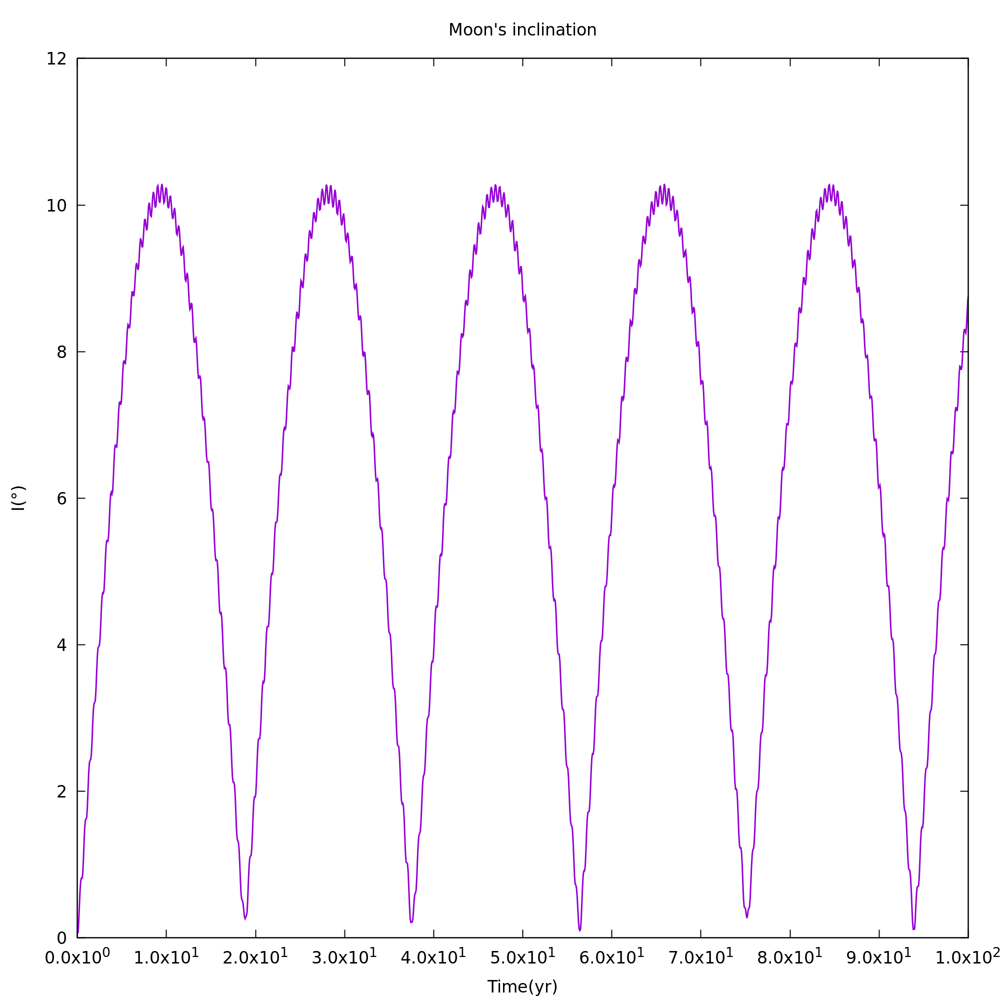
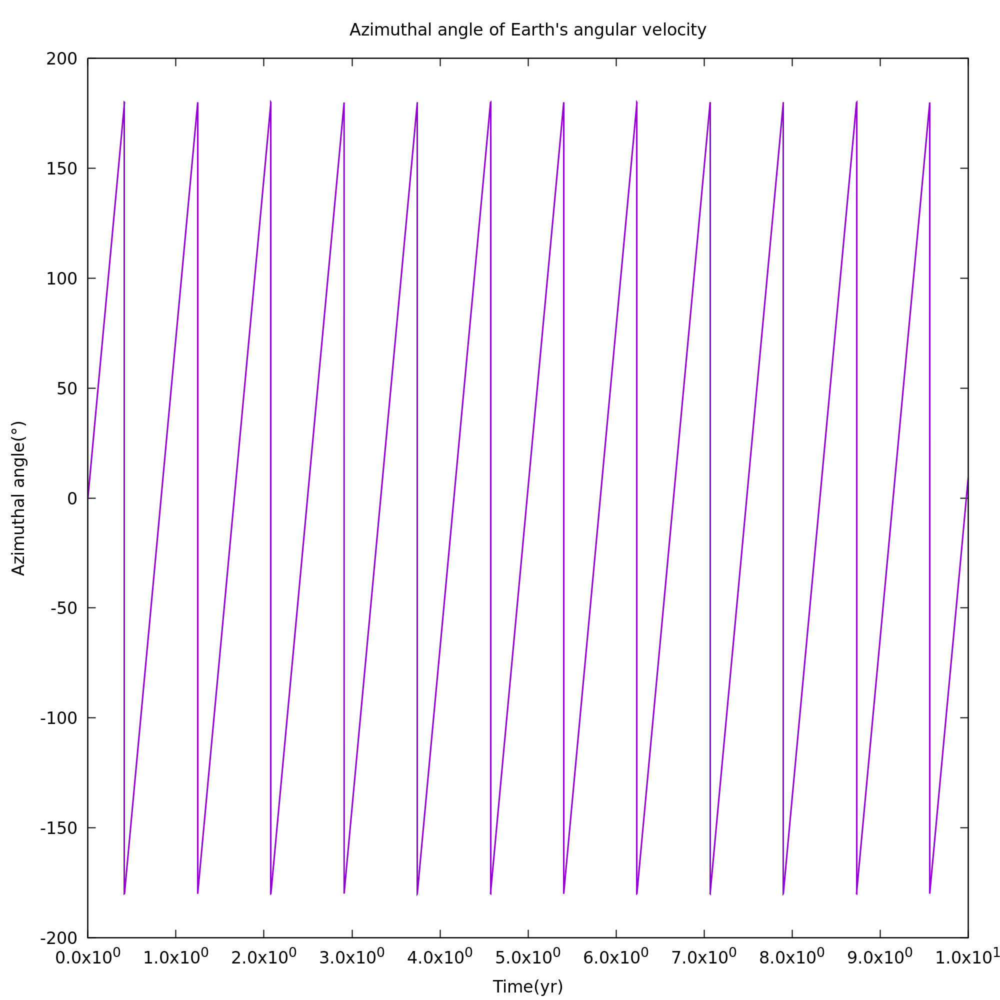
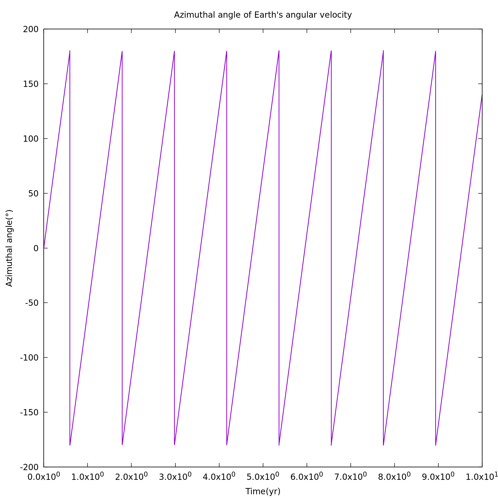
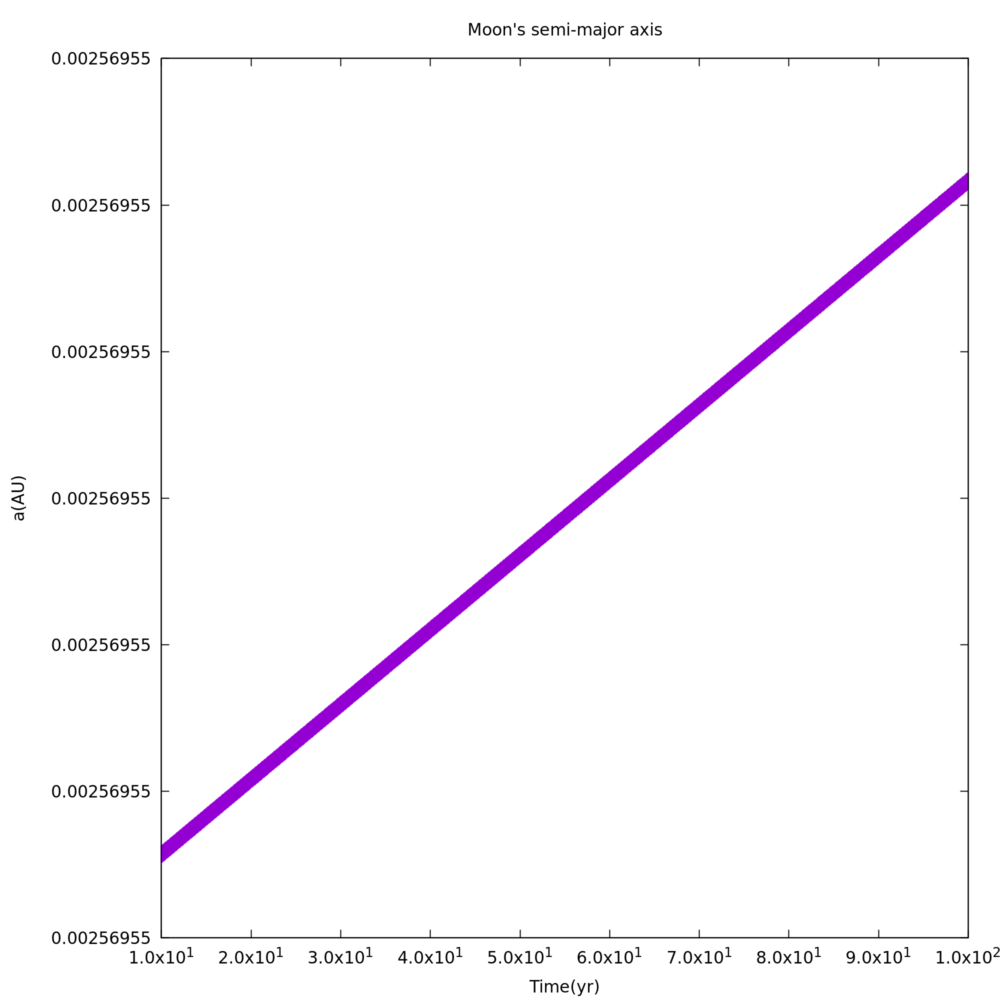

# RheoVolution
Software for numerically investigating the dynamical evolution of deformable 
celestial bodies based on the tidal theory developed by Clodoaldo Ragazzo and 
Lucas Ruiz.

This work is part of a postdoctoral project from the São Paulo Research 
Foundation (FAPESP - Grants 2021/11306-0 and 2022/12785-1), carried out 
by Vitor M. de Oliveira at the Institute of Mathematics and Statistics 
of the University of São Paulo (Brazil) and at the Centre for Physics 
of the University of Coimbra (Portugal), under the supervision of prof. 
Clodoaldo Ragazzo (IME/USP) and with the collaboration of prof. Alexandre 
Correia (CFisUC).

>Author: V. M. de Oliveira
>
>Contact: <vitormo@ime.usp.br>
>
>Last update on this file: November 11th 2024

## Important notes

### Description

This program simulates the tidal evolution of any number of celestial bodies 
interacting gravitationally with each other. The rheological model adopted 
here is based on the generalised Voigt viscoelastic model, which can be 
reduced to the Maxwell viscoelastic model. 
The equations of motion are numerically integrated using a Prince-Dormand 
Runge-Kutta scheme of 7th and 8th order with adaptive stepsize from the GNU 
Scientific Library (GSL). It was developed and tested in Ubuntu 22.04.5 LTS 
(Jammy Jellyfish).

### Theory

The tidal theory used here deals with the celestial bodies' deformation in 
the time domain. For more information, please check the following article:

>de Oliveira, V. M., Ragazzo, C., Correia, A. C. M. (2024). RheoVolution: 
an N-body simulator for tidally evolving bodies with complex rheological 
models. *Astronomy & Astrophysics*, to be published.

## Building from source

### Install dependencies

Building the program requires a c compiler, make, and the Gnu Scientific 
Library version 2.7. Running the plot feature of the program requires Gnuplot. 
In Ubuntu, the user may use the following command to install all necessary 
dependencies

```bash
apt install build-essential libgsl27 libgsl-dev gnuplot
```

### Compile

To compile the code and produce the executable ``rheo``, use

```bash
make
```

## Running the software

### User inputs

The user needs to provide the program with a ``configuration_file.dat``, 
which should specify the simulation id, the location of the input files, 
the location for the output files, and the name of the input files 
containing system and integration specifications. This information should 
be provided in a specific format (see examples folder and files therein).

The number of bodies to be considered from the system specs file can also 
be given in the configuration file. If this value is not passed to the 
program, the total number of bodies in the system specs file is assumed.

<!--

| Syntax      | Description |
| ----------- | ----------- |
| Header      | Title |
| Paragraph   | First paragraph |

-->

### Run

To run the program, the configuration file should be passed along in the 
following manner:

```bash
./rheo configuration_file.dat
```

### Output

A folder named ``output_id`` containing the simulation data is created at 
the location provided by the user in the configuration file. This data 
contains the time evolution of each of the bodies' dynamical variables.

### Additional features

After running the program and obtaining the dynamical variables' time 
evolution, it is possible to calculate the orbital elements of every 
celestial body using

```bash
./rheo configuration_file.dat orbit
```

And also to calculate the spin variables of every celestial body using

```bash
./rheo configuration_file.dat spin
```

All this information is stored in the output folder.

Finally, using the previous data, it is possible to plot the time 
evolution of the main variables in the system via

```bash
./rheo configuration_file.dat plot
```

The plot command uses the software ``Gnuplot`` and it stores the ouput 
in a subfolder named ``figures``.

### Using make

For convenience, the aforementioned commands are already implemented 
in the Makefile, and they can be used in the following manner

```bash
make run INPUT=configuration_file.dat
make spin INPUT=configuration_file.dat
make plot INPUT=configuration_file.dat
```

If the user wants to run the code and calculate all of the additional 
features with one command, it can be done by typing

```bash
make all INPUT=configuration_file.dat
```

## Examples

This project contains six examples, whose configuration files can be 
found in the ``examples`` folder. These examples should work as a guide 
for using the code and also serve as benchmark to check if the program 
is working properly in the user's computer.

### Example 1 - Earth-Moon-Sun system

This example simulates the dynamics of a system containing Earth, Moon, and 
Sun, all of which are treated as point masses. The main feature to be 
observed here is the lunar precession period of 18 months, which can be 
seen in the "I (°) vs Time (yr)" plot, where "I" is the lunar orbital 
inclination. See "figure_Example_1_EMS_Moon_inclination.png" in the output of Example 1.

<p align="center">
    
</p>

### Example 2 - Isolated rigid Earth

This example simulates the dynamics of a rigid Earth with no external 
perturbations. The main dynamical feature to be seen here is Earth's 
nutation period, which would amount to 10 months if Earth was a rigid 
ellispoid. Such value can be seen in the "Azimuthal angle (°) vs Time (yr)" 
plot. See "figure_Example_2_E_rigid_Earth_azimuthal_angle.png" in the output of Example 2.

<p align="center">
    
</p>

### Example 3 - Isolated deformable Earth with Maxwell rheology

This example simulates the same system as before but with Earth now a 
deformable body. In this case, Earth's nutation period such be approximately 
433 days. See "figure_Example_3_E_deformable_Earth_azimuthal_angle.png" in the output of Example 3.

<p align="center">
    
</p>

The enlargment of Earth's nutation period due to its elastic properties is 
called *Chandler Wobble*. Such effect was used to calibrate Earth in this 
example.

### Example 4 - Earth-Moon system with Maxwell rheology

This example simulates the dynamics a system containing the Earth and the 
Moon, where the Earth is a deformable extended body rotating with no 
obliquity and the Moon is a point mass orbiting the Earth in a 
Keplerian orbit with zero eccentricity. The feature of interest here is the 
increase in the distance between the Earth and the Moon at a rate of about 
3.8 cm/yr. Such effect was used to calibrate Earth's rheology in this 
situtation, and can be observed in the "a (AU) vs Time (yr)" plot, 
where "a" is the orbit's semi-major axis. See "figure_Example_4_EM_Maxwell_Moon_semi_major_axis.png" in the output of Example 4.

<p align="center">
    
</p>

### Example 5 - Earth-Moon system with Burgers rheology - Chandler Wobble

This and the next examples simulate the Earth-Moon system, with Earth as a deformable body and Moon as a point-mass, but using a more complex rheological model for the Earth called Burgers model. Here, both Chandler Wobble and lunar drift were used to calibrate Earth's rheology. This example is run using the same integration specifications as those of Example 3. We may observe here the Chandler Wobble. See "figure_Example_5_EM_Burgers_Chandler_Wobble_Earth_azimuthal_angle.png" in the output of Example 5.

<p align="center">
    
</p>

### Example 6 - Earth-Moon system with Burgers rheology - Moon's orbital drift

This example is run using the same integration specifications as those of Example 4. We may observe here the lunar orbital drift. See "figure_Example_6_EM_Burgers_Moon_orbital_drift_Moon_semi_major_axis.png" in the output of Example 6.

<p align="center">
    
</p>

### Using make

All examples can be run at once with

```bash
make examples
```

And at the same time with

```bash
make examples_parallel
```
